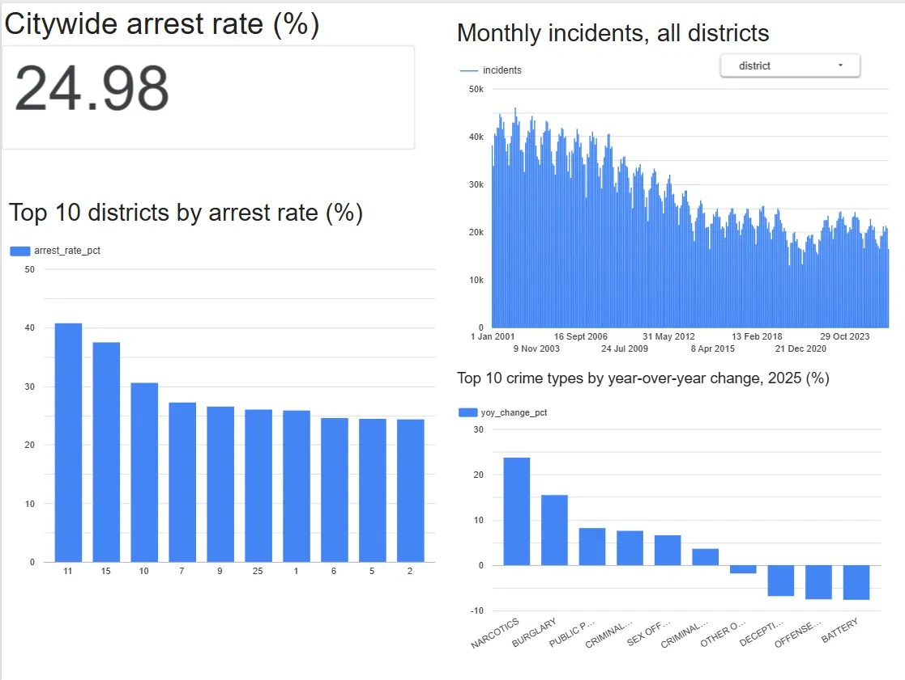
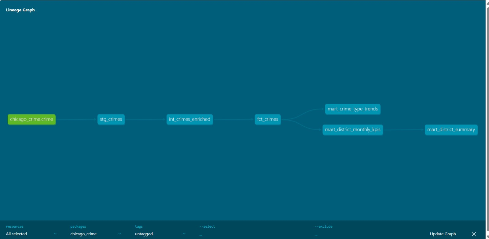

# Chicago Crime Analytics Pipeline


A dbt project that turns 8.65 million public Chicago crime records into tested, partitioned KPI tables on BigQuery, with a Looker Studio dashboard on top. It runs entirely on free tiers.

**Live links:** [Dashboard](https://datastudio.google.com/reporting/23d2fd3c-b7c4-4b51-b55a-10f401dcbb32) | [dbt docs and lineage](https://sohailalij.github.io/chicago-crime-dbt/)



## Table of contents

- [About the project](#about-the-project)
- [Results](#results)
- [Data models](#data-models)
- [How to use it](#how-to-use-it)
- [Getting started](#getting-started)
- [Tests](#tests)
- [Design decisions and challenges](#design-decisions-and-challenges)
- [CI and docs](#ci-and-docs)
- [What I learned](#what-i-learned)
- [Future improvements](#future-improvements)
- [Credits](#credits)
- [License](#license)

## About the project

The public Chicago crime table holds about 8.65 million rows and is not partitioned or clustered. Every question about it, such as arrest rates by district, scans far more data than it needs. This project builds a layered dbt pipeline on top of that table so common questions run against small, tested tables instead.

I built it to practice analytics engineering end to end and to measure what each design choice changes. The pipeline answers questions like:

- Which police districts have arrest rates well above or below the citywide rate?
- How have monthly incident counts changed since 2001?
- Which crime types grew or shrank the most last year?

**Stack:** dbt Core 1.12, dbt-bigquery, dbt_utils, BigQuery sandbox, GitHub Actions, GitHub Pages, Looker Studio.

## Results

| Measure | Result |
|---|---|
| Records modeled | 8,652,385 |
| Bytes scanned, one district and year (raw table vs fact table) | 140.28 MB to 4.21 MB (97.0% less) |
| Bytes scanned, all-district arrest rates (raw table vs mart) | 74.26 MB to 600 B (99.999% less) |
| dbt tests | 25 (24 pass, 1 warning for missing district) |
| Staging and mart columns documented | 100% |
| Duplicate incident IDs | 0 |
| Records missing ward / latitude / district | 7.14% / 1.17% / 0.001% |

Findings from the marts:

- District 11 has an arrest rate of 40.73% against 24.98% citywide, about 63% higher.
- In 2025, narcotics incidents rose 23.69% and burglary rose 15.44% year over year.

The bytes figures compare identical queries run against the raw public table and against the dbt models. Both versions returned the same results.

## Data models



| Layer | Model | Purpose |
|---|---|---|
| staging | stg_crimes | Keeps 15 of 22 columns, renames and casts |
| intermediate | int_crimes_enriched | Adds month, hour, and a night flag |
| marts | fct_crimes | Partitioned by year (integer range), clustered by district and crime type |
| marts | mart_district_monthly_kpis | Monthly arrest, domestic, and night shares plus year-over-year change per district |
| marts | mart_district_summary | District totals against the citywide arrest rate |
| marts | mart_crime_type_trends | Yearly counts, shares, and year-over-year change per crime type |

## How to use it

- Open the [dashboard](https://datastudio.google.com/reporting/23d2fd3c-b7c4-4b51-b55a-10f401dcbb32) to see arrest rates by district, monthly incident trends, and crime types with the biggest yearly change.
- Open the [dbt docs](https://sohailalij.github.io/chicago-crime-dbt/) to browse models, column descriptions, tests, and lineage.
- Query the marts directly in BigQuery after running the project:

```sql
select district, incidents, arrest_rate_pct, citywide_arrest_rate_pct
from `YOUR_PROJECT.chicago_crime_dbt.mart_district_summary`
where incidents >= 1000
order by arrest_rate_pct desc
```

## Getting started

You need Python 3.9 or newer, git, and a Google account. No credit card is required.

1. Clone the repository:
```
   git clone https://github.com/sohailalij/chicago-crime-dbt.git
   cd chicago-crime-dbt
```
2. Create a Google Cloud project and use the BigQuery sandbox. Create a dataset named `chicago_crime_dbt` in the US location.
3. Install dependencies and log in:
```
   python -m venv .venv
   pip install -r requirements.txt
   gcloud auth application-default login
```
4. Create a dbt profile named `chicago_crime` (oauth, location US) in `~/.dbt/profiles.yml` that points to your project and dataset.
5. Build and test:
```
   cd chicago_crime
   dbt deps
   dbt build
```

Sandbox tables expire after 60 days. Run `dbt build` again to recreate them.

## Tests

`dbt build` runs all 25 tests. They cover:

- `unique` and `not_null` on incident IDs and key columns
- `not_null` with a warning severity on `district`, because a small share of records lacks one
- `accepted_range` from dbt_utils, which keeps every percentage column between 0 and 100
- `unique_combination_of_columns` on the grain of each mart

Run only the tests with `dbt test`.

## Design decisions and challenges

- **Integer partitioning.** The fact table is partitioned on an integer year, not a date. BigQuery sandbox expires time partitions after 60 days, which would delete the historical data on load.
- **Safe rate math.** Rate columns use `safe_divide`, and every percentage column is tested to stay within 0 and 100.
- **Year-over-year logic.** The comparison uses a self-join on the prior period, so gaps in a district's history do not shift the comparison.
- **Partial years.** The latest year in the trends mart is dropped because it is incomplete.
- **Small samples.** Districts with very few incidents, such as retired districts 21 and 31, show extreme rates, so the dashboard filters them out.
- **Data types in Looker Studio.** Year fields were detected as dates, which broke filters. Changing the field type to a number fixed it.

## CI and docs

- `dbt CI` runs `dbt deps` and `dbt parse` on every push, which catches YAML errors and broken references.
- `Deploy dbt docs` builds the docs site and publishes it to GitHub Pages.

Neither workflow needs credentials, so the repository holds no secrets. The docs site is built without a warehouse connection, so it shows models, descriptions, tests, and lineage but not column types or row counts.

## What I learned

- Partitioning and clustering cut scanned bytes the most when queries filter on the partition and cluster columns.
- Pre-aggregated marts keep dashboard queries cheap, but they need tests so that stale or wrong numbers get caught.
- Profiling the source data early shows which columns can be trusted. About 7% of records had no ward.
- CI for a warehouse project can still be useful without warehouse access, because parsing catches many errors.

## Future improvements

- Convert the fact table to an incremental model.
- Run `dbt build` in CI with a service account.
- Add SQL linting with SQLFluff.
- Add source freshness checks.

## Credits

Data comes from the City of Chicago Data Portal through the BigQuery public dataset `bigquery-public-data.chicago_crime.crime`.

## License

Released under the MIT License. See the [LICENSE](LICENSE) file.